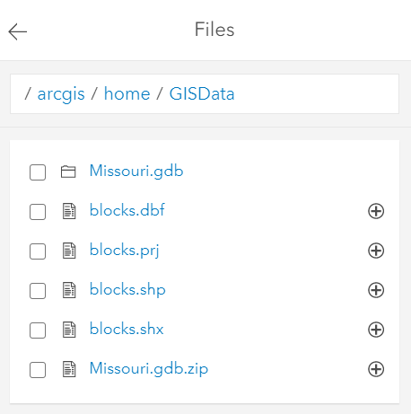

# This Week's Reading

Please read Chapters 2 and 3 of [Python Scripting for ArcGIS Pro](https://esripress.esri.com/display/index.cfm?fuseaction=display&websiteID=384&moduleID=12). 
These two chapters cover Python IDEs and Geoprocessing in ArcGIS Pro. 
This will set a foundation for much of what we do.

# Presentations
Here are the slides introducing geoprocessing and the Python Window in ArcGIS Pro.
Attached Files:

    File Lecture_1_Geoprocessing_and_Python_Window.pptx Click for more options (2.341 MB) 

# Data and Notebooks
This week's lecture notebooks can be found 
at https://slustl.maps.arcgis.com/home/group.html?id=724c1bfb085843debf8f1020b3654045#overview .

There is an [ArcGIS Pro package](https://slustl.maps.arcgis.com/home/item.html?id=3179070f893247d6bc7be395ee9ff9c8) there that you can download that 
I will use for the lecture.

I also plan to use the [blocks_shape](https://slustl.maps.arcgis.com/home/item.html?id=f9d83ef4e16b4eae862cf0301b59ae2e) data there.
Attached Files:

    File unit_2_lesson_1_geoprocessing_in_arcgis_pro.ipynb Click for more options (8.834 KB)
    File unit_2_lesson_1_geoprocessing_in_arcmap.ipynb Click for more options (8.57 KB)
    File unit_2_lesson_2_arcpy_in_arcgis_notebooks.ipynb Click for more options (26.66 KB)
    File unit_2_lesson_2_arcpy_in_arcgis_pro.ipynb Click for more options (21.771 KB)
    File unit_1_lesson_2_more_python.ipynb Click for more options (19.851 KB)
    File Missouri.gdb.zip Click for more options (10.712 MB) 


# Last Year's Week 2 Lecture Recording
Last year's Week 2 lectures:

Part 1: https://slu.hosted.panopto.com/Panopto/Pages/Viewer.aspx?id=d4e94b2a-8e89-47c0-bd5e-ab4f016ea1f8
Part 2: https://slu.hosted.panopto.com/Panopto/Pages/Viewer.aspx?id=fc541dcd-68e9-4a2c-8f7a-ab4f017f8ed7
Part 3: https://slu.hosted.panopto.com/Panopto/Pages/Viewer.aspx?id=81b0afd2-d392-4713-8f09-ab50000572f1

# Unit 2 Exercise and Discussion Questions
## Exercise
Please complete the following exercises. 
You do not need to submit anything, but it is recommended that you complete these.

- [Getting Started with Python in ArcGIS Pro](https://learn.arcgis.com/en/projects/get-started-with-python-in-arcgis-pro/)
- [Please Complete Python Scripting Exercise 3](https://learngis.maps.arcgis.com/home/item.html?id=3978b52f1e5847c69ef7eaded85780b2). You can find the data [here](https://learngis.maps.arcgis.com/home/item.html?id=d7c05cf515c046c2bedacb2e8e24722c).
- [(Optional) Beginner's guide to Python in ArcGIS Pro, Part 3: Tutorial](https://www.esri.com/arcgis-blog/products/arcgis-pro/uncategorized/beginners-guide-to-python-in-arcgis-pro-part-3-tutorial/)
- (Optional) Please run through the ArcGIS Notebook sample for [Forest-based Classification: Predict asthma rates.](https://slustl.maps.arcgis.com/home/item.html?id=56f418e2fd4f4030917d048fd87c078f) 
This is both an exelent example of how to work with ```arcpy``` in ArcGIS Notebooks and using GIS to perform predictive analysis

## Questions
Please submit a text file or word document answering the following questions.


    What does IDE stand for?
    What is the extension of a Python script file?
    What is the extension of a Jupyter notebook (or ArcGIS Notebook) file? Hint: Download an ArcGIS Notebook.


# Unit 2 Assignment
Attached Files:

    File blocks_shape.zip Click for more options (6.165 MB) 

Following from today's lecture, I want you to perform the same analysis in 
two different ways:
1. In the ArcGIS Pro Python Window, find the number of St. Louis City blocks that are found 
in the blocks shapefile (blocks.shp) using [get count](https://pro.arcgis.com/en/pro-app/latest/tool-reference/data-management/get-count.htm). 
Then, create a [minimum bounding geometry](https://pro.arcgis.com/en/pro-app/latest/tool-reference/data-management/minimum-bounding-geometry.htm) 
polygon of the same blocks shapefile. 
2. Add that polygon to the map, take a screenshot, and submit the screenshot. 
Using an ArcGIS Notebook, perform the same analysis. First, unzip the blocks_shape.zip. 
Upload all of the files from blocks.zip to the ArcGIS Notebooks Files 
so that it looks similar to this:


In the ArcGIS Notebook, find the number of St. Louis City blocks that are found 
in the blocks shapefile (blocks.shp) using get count. 
Then, create a minimum bounding geometry polygon of the same blocks shapefile. 
Submit a link to the notebook.

If you can't get this working in an ArcGIS Notebook, 
try doing this using Jupyter on your local computer.


